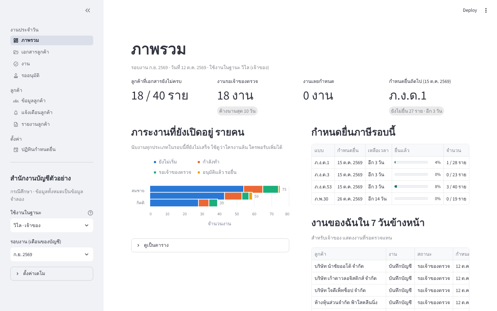
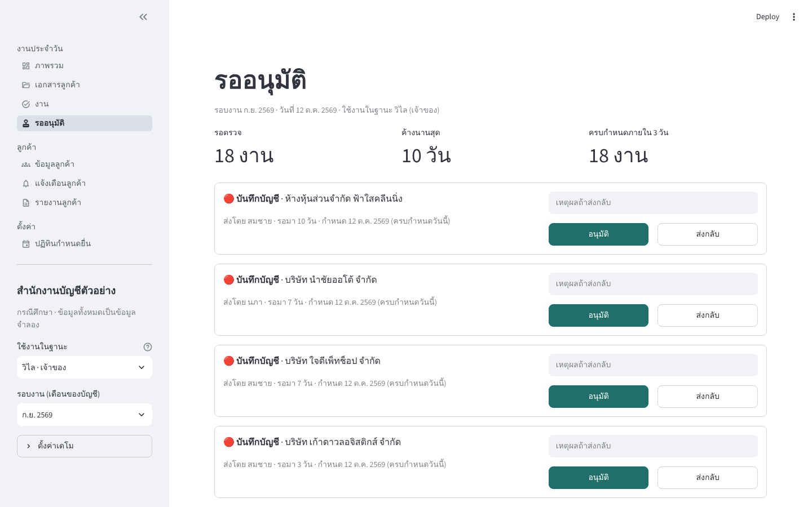
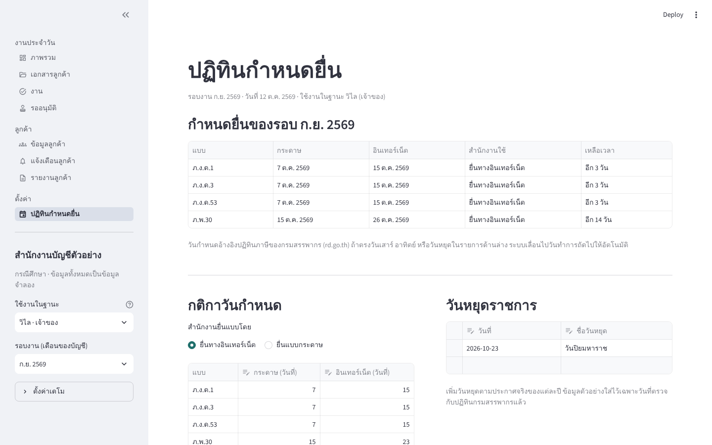

# ระบบติดตามงานสำนักงานบัญชี (Accounting Office Job Tracker)

ระบบติดตามงานรายเดือนสำหรับสำนักงานบัญชีขนาดเล็ก ตั้งแต่รับเอกสารจากลูกค้า บันทึกบัญชี ให้เจ้าของตรวจอนุมัติ ยื่นภาษี จนถึงส่งรายงานให้ลูกค้า

> **กรณีศึกษา (Case Study):** ปัญหาตั้งต้นมาจากการพูดคุยกับสำนักงานบัญชีจริง ส่วนโปรไฟล์สำนักงาน พนักงาน ลูกค้า 40 ราย และตัวเลขทั้งหมดเป็น **ข้อมูลจำลอง** ไม่มีข้อมูลลูกค้าหรือเอกสารภาษีจริง

*A Streamlit + SQLite case-study app that tracks a small accounting office's monthly cycle — document intake, bookkeeping, owner approval, tax filing deadlines and client notifications. All data is synthetic.*



## บทบาทของฉันในโปรเจกต์

โปรเจกต์นี้ทำในมุมนักวิเคราะห์ธุรกิจ (BA): ฉันเก็บปัญหาจากการพูดคุยกับสำนักงานบัญชี สรุปเป็นความต้องการ ตัดสินใจขอบเขต และให้ AI ช่วยเขียนโค้ดตามความต้องการนั้น ตัวอย่างการตัดสินใจ:

- **ตัดสิ่งที่ไม่แก้ปัญหาหลัก** เช่น OCR และพอร์ทัลลูกค้า จึงอยู่นอกขอบเขต
- **กำหนดบทบาท 2 ระดับ** คือเจ้าของกับพนักงาน และให้เจ้าของเป็นคนอนุมัติงานก่อนยื่นภาษีทุกครั้ง
- **เลือกแจ้งเตือนลูกค้าอัตโนมัติ** แทนให้ลูกค้าล็อกอินเข้ามาดูสถานะเอง เพราะลดงานตอบคำถามซ้ำโดยไม่ต้องสร้างระบบบัญชีผู้ใช้ให้ลูกค้า
- **ตรวจกติกากำหนดยื่นภาษีกับเอกสารกรมสรรพากร** ไม่เดาเอง

## ปัญหาที่ระบบแก้

| ปัญหาเดิม | สิ่งที่ระบบทำ | หน้า |
|---|---|---|
| เอกสารไม่ครบหรืออ่านไม่ออก ต้องขอใหม่ | รายการเอกสารที่ลูกค้าแต่ละรายต้องส่ง พร้อมสถานะ ได้รับแล้ว / ยังไม่ได้รับ / ต้องขอใหม่ | เอกสารลูกค้า |
| เอกสารกระจายหลายช่องทาง (LINE, อีเมล, กระดาษ) | ลงทะเบียนเอกสารจากทุกช่องทางที่เดียว ต้องระบุช่องทางทุกครั้งที่รับ | เอกสารลูกค้า |
| ไม่รู้ว่าลูกค้ารายไหนยังขาดอะไร | สรุปรายลูกค้า เรียงจากขาดมากสุด และกดเตือนลูกค้าที่ยังขาดได้ในครั้งเดียว | เอกสารลูกค้า |
| งานกระจุกต้นถึงกลางเดือน คนล้นคนว่าง | กราฟภาระงานที่ยังเปิดอยู่รายคน | ภาพรวม |
| งานผูกกับคนเดียว คนอื่นรับช่วงยาก | ผู้รับผิดชอบหลัก/สำรองต่อลูกค้า และเจ้าของย้ายงานได้ | ข้อมูลลูกค้า, งาน |
| พนักงานใหม่ไม่มีบันทึกวิธีทำงานต่อลูกค้า | บันทึกข้อควรระวังรายลูกค้า แสดงทุกครั้งที่เปิดงานของลูกค้ารายนั้น | ข้อมูลลูกค้า, งาน |
| ติดตามกำหนดส่งด้วยปฏิทิน/Excel ส่วนตัว | คำนวณวันกำหนดยื่นจากกติกากรมสรรพากร เลื่อนวันหยุดอัตโนมัติ และแสดงเวลาที่เหลือ | ปฏิทินกำหนดยื่น, ภาพรวม |
| งานรอเจ้าของตรวจค้างเป็นคอขวด | คิวรออนุมัติเรียงตามวันกำหนด แสดงจำนวนวันที่ค้าง อนุมัติหรือส่งกลับพร้อมเหตุผล | รออนุมัติ |
| ลูกค้าถามสถานะบ่อย ต้องตอบทีละราย | แจ้งเตือนลูกค้าอัตโนมัติเมื่อสถานะเปลี่ยน ลูกค้าไม่ต้องเข้าระบบ | แจ้งเตือนลูกค้า |
| ส่งรายงานด้วยมือ ไม่เป็นมาตรฐาน | รายงานรายเดือนจากแม่แบบเดียวกัน สร้างจากข้อมูลในระบบ ดาวน์โหลดได้ | รายงานลูกค้า |
| ข้อมูลลูกค้าอยู่ในไฟล์ส่วนตัวของพนักงาน | ฐานข้อมูลลูกค้ากลาง | ข้อมูลลูกค้า |

**นอกขอบเขต:** การคีย์บัญชีอัตโนมัติ (OCR) และพอร์ทัลให้ลูกค้าล็อกอินเข้ามาดูเอง

## ขั้นตอนงานในระบบ

```
บันทึกบัญชี:   ยังไม่เริ่ม → กำลังทำ → รอเจ้าของตรวจ → เสร็จ
แบบภาษี:       ยังไม่เริ่ม → กำลังทำ → รอเจ้าของตรวจ → อนุมัติแล้ว รอยื่น → ยื่นแล้ว
รายงานลูกค้า:   ยังไม่เริ่ม → กำลังทำ → เสร็จ
```

- เจ้าของเท่านั้นที่อนุมัติหรือส่งงานกลับได้ และการส่งกลับต้องใส่เหตุผล
- ยื่นแบบได้หลังเจ้าของอนุมัติเท่านั้น
- ทุกการเปลี่ยนสถานะถูกบันทึกเป็นประวัติ (ใคร ทำอะไร เมื่อไร)
- ระบบส่งข้อความหาลูกค้าเมื่อ ได้รับเอกสารครบ / ยื่นภาษีแล้ว / ส่งรายงานแล้ว (ในเดโมบันทึกไว้ในกล่องขาออก ไม่ได้ส่งจริง)



## กำหนดยื่นภาษี

ค่าเริ่มต้นตามปฏิทินภาษีของ[กรมสรรพากร](https://www.rd.go.th/62348.html) ปี 2569:

| แบบ | ยื่นกระดาษ | ยื่นทางอินเทอร์เน็ต |
|---|---|---|
| ภ.ง.ด.1, 3, 53 | วันที่ 7 ของเดือนถัดไป | วันที่ 15 |
| ภ.พ.30 | วันที่ 15 ของเดือนถัดไป | วันที่ 23 |

ถ้าวันกำหนดตรงวันเสาร์ อาทิตย์ หรือวันหยุดที่บันทึกไว้ ระบบเลื่อนเป็นวันทำการถัดไป เช่น ภ.พ.30 ของเดือน ก.ย. 2569 ครบกำหนด 26 ต.ค. 2569 เพราะ 23 ต.ค. เป็นวันปิยมหาราช (ตรงกับปฏิทินกรมสรรพากร) วันกำหนดและวันหยุดแก้ได้ในหน้าปฏิทินกำหนดยื่น เพราะการขยายเวลายื่นออนไลน์มาจากประกาศที่ต่ออายุเป็นช่วง ๆ

## ข้อมูลส่วนบุคคล (PDPA)

- ข้อความแจ้งเตือนลูกค้าบอกเฉพาะสถานะงาน ไม่แนบเอกสารหรือตัวเลขทางการเงิน
- บันทึกประวัติการเปลี่ยนแปลงงานทุกครั้ง เพื่อตรวจสอบย้อนหลังได้
- ข้อมูลตัวอย่างทั้งหมดเป็นข้อมูลสังเคราะห์ อีเมลใช้โดเมน example.com

## เทคโนโลยี

- **Python 3.11+**, **Streamlit** (หน้าเว็บ), **SQLite** (ฐานข้อมูล), **pandas**, **Altair** (กราฟ)
- **pytest** 116 เทสต์: กติกาวันกำหนด ขั้นตอนอนุมัติ การทำงานกับฐานข้อมูล และ **ทดสอบปุ่มทุกปุ่มในทุกหน้า** ด้วย Streamlit AppTest (ครบทั้ง 3 บทบาท)

## วิธีรันบนเครื่อง

**Windows (ง่ายที่สุด):** ติดตั้ง [Python](https://www.python.org/downloads/) แล้วดับเบิลคลิกไฟล์ `start.bat` ครั้งแรกจะติดตั้งไลบรารีให้อัตโนมัติ แล้วเปิดเบราว์เซอร์ที่ http://localhost:8501

**macOS / Linux / ทำเอง:**

```bash
git clone https://github.com/<username>/accounting-tracker.git
cd accounting-tracker
python -m venv .venv
source .venv/bin/activate        # Windows: .venv\Scripts\activate
pip install -r requirements.txt
streamlit run app.py
```

เปิดเบราว์เซอร์ที่ http://localhost:8501 ครั้งแรกระบบจะสร้างฐานข้อมูลและข้อมูลตัวอย่างให้อัตโนมัติ

**ลองใช้งาน:** เลือก "ใช้งานในฐานะ" ที่แถบด้านซ้ายเพื่อสลับระหว่างเจ้าของ พนักงานบัญชี และธุรการ แต่ละบทบาททำได้ต่างกัน ส่วน "ตั้งค่าเดโม" ใช้เปลี่ยนวันที่จำลอง เปิดรอบเดือนใหม่ หรือโหลดข้อมูลตัวอย่างใหม่

### รันชุดทดสอบ

```bash
pip install -r requirements-dev.txt
pytest
```

ชุดทดสอบแบ่งเป็น 3 ส่วน: `test_deadlines.py` (กติกากรมสรรพากรและวันหยุด), `test_workflow.py` / `test_repo.py` (ขั้นตอนงานและสิทธิ์ตามบทบาท) และ `test_ui_buttons.py` (กดปุ่มจริงในทุกหน้า ตรวจว่าไม่มี error และสิทธิ์ถูกต้อง ทดสอบนี้เคยจับบั๊กปุ่ม "เปิดรอบงาน" ได้) พอ push ขึ้น GitHub ระบบ GitHub Actions จะรันให้อัตโนมัติ

## โครงสร้างโปรเจกต์

```
app.py                 จุดเริ่มต้นและเมนู
tracker/               ตรรกะของระบบ (ไม่ขึ้นกับ Streamlit)
  db.py                โครงสร้างตาราง SQLite
  deadlines.py         กติกาวันกำหนดยื่นและการเลื่อนวันหยุด
  workflow.py          สถานะงานและสิทธิ์ตามบทบาท
  repo.py              คำสั่งอ่าน/เขียนข้อมูล การแจ้งเตือน และรายงาน
  seed.py              ข้อมูลจำลอง
views/                 หน้าจอแต่ละหน้า
tests/                 ชุดทดสอบ (ตรรกะ + ปุ่มทุกหน้า)
assets/                โลโก้และไอคอน
.streamlit/config.toml ธีมสีม่วง
```



## ข้อจำกัดของเดโม

- ไม่มีระบบล็อกอิน ใช้การเลือกบทบาทแทน
- การแจ้งเตือนไม่ได้ส่งจริง ระบบจริงต้องต่อ LINE Messaging API และ SMTP
- ไม่มีการอัปโหลดไฟล์เอกสาร บันทึกเฉพาะสถานะ
- เมื่อ deploy บน Streamlit Community Cloud ฐานข้อมูลจะกลับเป็นข้อมูลตัวอย่างเมื่อแอปรีสตาร์ต
